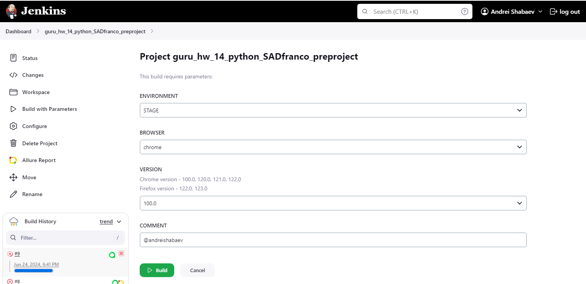

<h1> Testing online store TSUM</h1>

> <a target="_blank" href="https://www.tsum.ru/">Ссылка на сайт</a>

<!-- Tools -->

### USING TOOLS

  <code></code>
  <code></code>
  <code></code>
  <code></code>
  <code></code>
  <code></code>
  <code></code>
  <code></code>
  <code></code>
  <code></code>
  <code></code>
  <code></code>
  <code></code>
  <code></code>

<!-- Test Cases -->

### Test cases

WEB:
* ✅ Change region and language
* ✅ Check dropdown menu with regions
* ✅ Search item  
* ✅ Login existing user by email 
* ✅ Login user by non-existing email
* ✅ Check profile left menu 
* ✅ Logout from profile

<!-- Jenkins -->

###  Launch project on Jenkins

### [Task on Jenkins](https://jenkins.autotests.cloud/job/guru_hw_14_python_SADfranco_preproject)

##### You can choose parameters before starting a build in the menu "Build with parameters". You can add stand, comment, browser version. When you start the build, it launches testing on Selenoid machine.

<!-- Allure report -->

###  Allure report

### [Allure reports](https://jenkins.autotests.cloud/job/guru_hw_14_python_SADfranco_preproject/1/allure/#)

##### When automation executing tests finish, you can check results on Allure reports. The report link is on Jenkins page

##### There are information about testing duration, tests status and tests severity.

##### There are testing steps with descriptions, logs, screenshots and video on Suites page.

##### Video executing test (Successful login user)

<!-- Allure TestOps -->

###  Интеграция с Allure TestOps

### [Dashboard](https://allure.autotests.cloud/project/4303/dashboards)

##### All reports save to Allure TestOps, where you can see executing graphics.

#### There are all automation test cases with steps on Suites page:

<!-- Telegram -->

###  Integration with Telegram
##### When all tests finish, the notification will be sent to Telegram with running test results.

